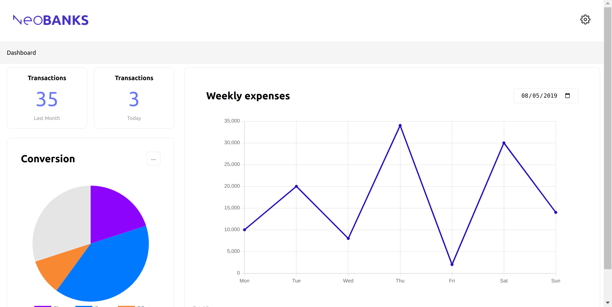
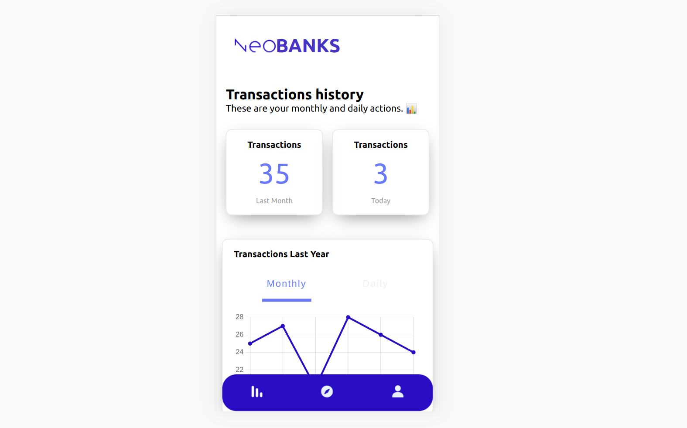

# React Cross Plataform | CaixaBank Tech y Nuwe

El reto consiste en implementar una aplciación web y móvil diseñada en Figma.

En mi caso, he implementado solo la aplicación web por dos razones:
  - Llevo 1 año y medio programando y a día de hoy no he aprendido todo lo que me gustaría de React Native.
  - Creando una aplicación móvil se obliga al cliente a tener que descargar e instalar esa aplicación en sus dispositivos ocupando una pequeña parte de su memoria. Por esta razón, me he esforzado en crear una aplicación web muy sólida tanto para PC como para móviles o tablets adaptandome a los requerimientos del diseño en Figma.

La implementación es en una sola página con responsive. No he creado un nuevo diseño móvil para el diseño de PC y tampoco un nuevo diseño de PC para el diseño móvil porque me desviaría de los diseños proporcionados en Figma.

## Resultado final 🏁



## Detalles 📋

  - Estructura de código muy sencilla.
  - Posibilidad de implementarla en diferentes países gracias a [**i18n**](https://www.i18next.com/).

## Ejecución :star:
  
Una vez descargado el repositorio:

  - Instalar todas las dependencias
  
    ```
    npm install
    ```
    
  - Ejecutar la aplicación web en modo desarrollo
  
    ```
    npm run dev
    ```

## Autor ✒️
**Jesús Martín Zorrilla** - *Trabajo Inicial y Documentación*

- [Portafolio](https://jesusmarzor.com)
- [Linkedin](https://www.linkedin.com/in/jesusmarzor/)

## Licencia 📄
Este proyecto está bajo la Licencia (GNU General Public License v3.0) - mira el archivo [LICENSE](LICENSE) para detalles
